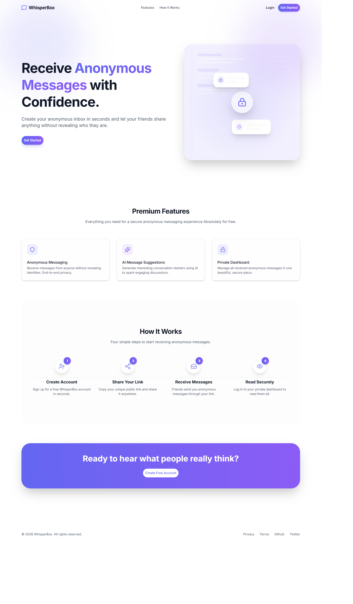
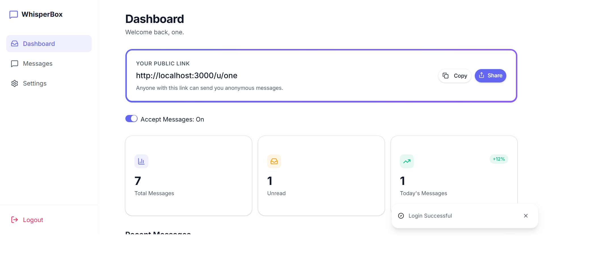
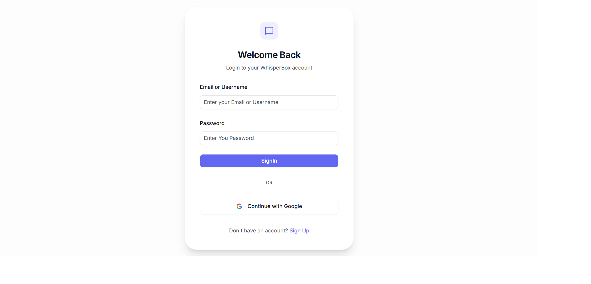
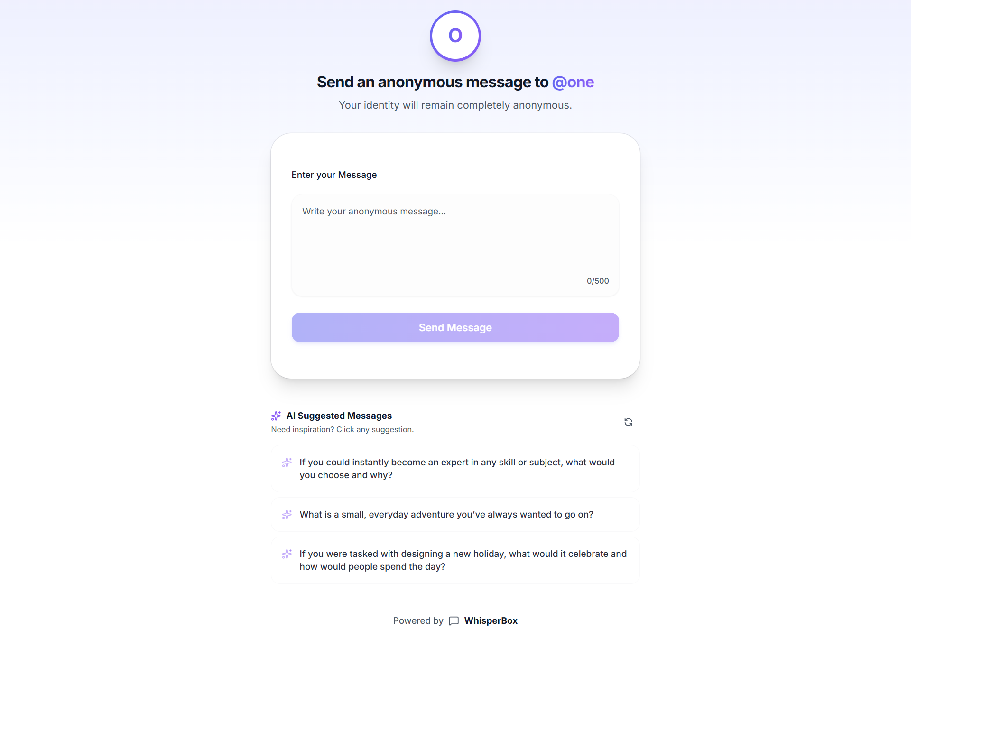

# 📦 WhisperBox

> **A modern anonymous messaging platform powered by AI.**
> Receive honest, anonymous messages through your personal link while maintaining complete privacy.

---

## ✨ About

**WhisperBox** is an anonymous messaging platform where anyone can send messages to users without revealing their identity.

Every registered user gets a unique public link that can be shared anywhere. Visitors can open that link and send anonymous messages instantly. To make conversations more engaging, WhisperBox also includes **AI-generated message suggestions** that users can click to auto-fill the message box.

Designed with a clean, modern SaaS interface using **Next.js**, **Tailwind CSS**, and **shadcn/ui**, WhisperBox focuses on privacy, simplicity, and an exceptional user experience.

---

## 🚀 Features

### 🔐 Authentication

* User Registration
* Secure Login
* Email Verification (OTP)
* Next-Auth Authentication
* Protected Routes

### 👤 User Dashboard

* Personalized Dashboard
* Public Anonymous Link
* One-click Copy Link
* View Received Messages
* Delete Messages
* Mark Messages as Read
* Responsive Card Layout

### 🤖 AI Features

* AI Generated Conversation Starters
* Refresh Suggestions
* Click-to-Fill Message Box
* Better User Engagement

### 💌 Anonymous Messaging

* No sender identity
* Public shareable profile
* Beautiful messaging interface
* Instant anonymous delivery

### 🎨 UI/UX

* Premium SaaS Design
* Dark & Light Mode
* Fully Responsive
* Modern Animations
* Accessible Components
* Built entirely with **shadcn/ui**

---

# 📸 Screenshots

| Home | Dashboard |
| ---- | --------- |
| ||

| Login | Public Link |
| ----- | ----------- |
|  ||

---

# 🛠 Tech Stack

## Frontend

* Next.js 15
* React 19
* TypeScript
* Tailwind CSS v4
* shadcn/ui
* React Hook Form
* Zod
* Lucide React
* Framer Motion

## Backend

* Next.js Server Actions / API Routes

## Database

* MongoDB
* Mongoose

## Authentication

* Next-Auth
* Email OTP Verification

## AI

* Google Gemini API

---

# 📂 Project Structure

````bash
```
└── 📁whisper-box
    └── 📁emails
        ├── VerificationEmail.tsx
    └── 📁public 
    └── 📁src
        └── 📁app
            └── 📁(app)
                └── 📁dashboard
                    └── 📁messages
                        ├── page.tsx
                    └── 📁settings
                        ├── page.tsx
                    ├── layout.tsx
                    ├── page.tsx
                    ├── temp.tsx
            └── 📁(auth)
                └── 📁sign-in
                    ├── page.tsx
                └── 📁sign-up
                    ├── page.tsx
                └── 📁verify
                    └── 📁[username]
                        ├── page.tsx
            └── 📁api
                └── 📁accept-messages
                    ├── route.ts
                └── 📁accessibility
                    ├── route.ts
                └── 📁auth
                    └── 📁[...nextauth]
                        ├── options.ts
                        ├── route.ts
                └── 📁check-username-unique
                    ├── route.ts
                └── 📁delete-message
                    └── 📁[messageid]
                        ├── route.ts
                └── 📁get-messages
                    ├── route.ts
                └── 📁send-message
                    ├── route.ts
                └── 📁sign-up
                    ├── route.ts
                └── 📁suggest-messages
                    ├── route.ts
                └── 📁verify-code
                    ├── route.ts
            └── 📁u
                └── 📁[username]
                    ├── page.tsx
            ├── favicon.ico
            ├── globals.css
            ├── layout.tsx
            ├── page.tsx
        └── 📁components
            └── 📁ui             
            ├── MessageCard.tsx
            ├── Navbar.tsx
        └── 📁context
            ├── authProvider.tsx
        └── 📁helpers
            ├── sendVerificationEmails.ts
        └── 📁lib
            ├── dbConnect.ts
            ├── resend.ts
            ├── utils.ts
        └── 📁models
            ├── User.ts
        └── 📁schemas
            ├── acceptMessageSchema.ts
            ├── messageSchema.ts
            ├── signUpSchema.ts
            ├── singInSchema.ts
            ├── verifySchema.ts
        └── 📁types
            ├── ApiResponse.ts
            ├── next-auth.d.ts
        ├── middleware.ts
    ├── .env
    ├── .gitignore
    ├── components.json
    ├── eslint.config.mjs
    ├── next-env.d.ts
    ├── next.config.ts
    ├── package-lock.json
    ├── package.json
    ├── postcss.config.mjs
    ├── README.md
    └── tsconfig.json
```
````

---

# 🌟 Pages

### 🏠 Home

* Beautiful Landing Page
* Hero Section
* Features
* How it Works
* CTA
* Footer

---

### 🔑 Login & Signup

* Email/Username
* Password
* Google Login (In Progress)

---
.### 📊 Dashboard

* User Statistics
* Public Share Link
* Copy to Clipboard
* Received Messages
* Delete Messages
* Responsive Cards
---
### 💬 Public Anonymous Page

Accessible without authentication.

Contains
* User Profile
* Textarea
* AI Suggested Messages

---

# ⚙️ Installation

## Clone the Repository

```bash
git clone https://github.com/am-aayush/whisperBox.git
```

---

## Install Dependencies

```bash
npm install
```

## Start Development Server

```bash
npm run dev
```

Visit

```
http://localhost:3000
```

---

# 🔒 Environment Variables

| Variable                     | Description               |
| ---------------------------- | ------------------------- |
| MONGODB_URI                  | MongoDB Connection String |
| NEXT_AUTH_SECRET             | Authentication Secret     |
| RESEND_API_KEY               | Email Service API Key     |
| GOOGLE_GENERATIVE_AI_API_KEY | Gemini API Key            |

---

# 📦 Future Improvements

* Real-time Notifications
* Message Reactions
* User Profiles
* Analytics Dashboard
* AI Message Moderation
* Voice Messages
* Image Attachments
* Multiple Themes
* Progressive Web App (PWA)
* Rate Limiting
* Admin Dashboard
* Social Sharing
* QR Code Generator
* Export Messages

---

# 🤝 Contributing

Contributions are always welcome!

1. Fork the project
2. Create your feature branch

```bash
git checkout -b feature/AmazingFeature
```

3. Commit your changes

```bash
git commit -m "Add AmazingFeature"
```

4. Push to the branch

```bash
git push origin feature/AmazingFeature
```

5. Open a Pull Request

---
# ⭐ Support
If you like this project, consider giving it a **⭐ Star** on GitHub. It helps others discover the project and motivates future development.
---

# 📄 License
This project is licensed under the **MIT License**.
---

# 👨‍💻 Author
**Aayush Maurya**
Full Stack Web Developer

<p align="center">
  <strong>Built with ❤️ By Aayush Maurya using Next.js, Tailwind CSS, shadcn/ui, MongoDB, and Google Gemini AI.</strong>
</p>

<p align="center">
  <em>WhisperBox — Because sometimes the most honest conversations happen anonymously.</em>
</p>
